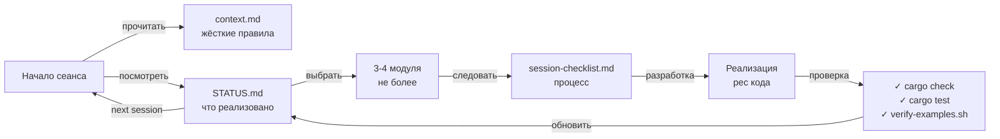

# .ai/ — Инструменты для разработки через ИИ

Этот каталог содержит инфраструктуру для эффективной работы ИИ-ассистентов с проектом.

---

## 📚 Файлы в этом каталоге

### 1. [context.md](context.md) — **ОБЯЗАТЕЛЬНО ПРОЧИТАТЬ ПЕРВЫМ**

**Что это:** System prompt для любого ИИ-ассистента (типа GitHub Copilot, Claude, GPT).

**Содержит:**
- ✅ Текущее состояние реализации (все однострочные стабы)
- ✅ Жёсткие запреты (HARD RULES) — что **категорически нельзя** делать
  - `std::fs` в core
  - `unwrap()` вне тестов
  - `tokio` в WASM
  - `tokio`/`sled` в WASM
  - Импорты cli в generator
- ✅ Приоритеты (Корректность > Производительность, WASM < 500KB, React/Vanilla критичны)
- ✅ Типичные грабли с решениями (пути в тестах, WASM compilation, complexity threshold)

**Когда читать:** Перед каждым сеансом разработки и перед любым code review.

---

### 2. [STATUS.md](../STATUS.md) — **ИСТОЧНИК ИСТИНЫ О ПРОГРЕССЕ**

**Что это:** 66 чекбоксов по всем модулям проекта. **Актуальный инвентарь того что сделано.**

**Содержит:**
- По каждому crate: `svg2web-core`, `svg2web-cache`, `svg2web-generator`, и т.д.
- По каждому модулю внутри: указаны **все функции и типы** которые нужно реализовать
- Чекбоксы: `[ ]` = стаб, `[x]` = реализовано и проходит тесты
- Итоговая таблица с прогрессом в %

**Правило: ассистент должен обновлять STATUS.md после каждого сеанса.**

**Пример:**
```markdown
### model/
- [x] `model/element.rs` — `SVGElement`, `Bounds`, `Transform`
- [ ] `model/style.rs` — `Style`, `Color`, `Font`, `Gradient`
```

---

### 3. [session-checklist.md](session-checklist.md) — **ПРОЦЕСС КАЖДОГО СЕАНСА**

**Что это:** Пошаговый чеклист "что сделать в начале, во время и в конце сеанса".

**Начало:**
- ✅ Прочитать context.md
- ✅ Посмотреть STATUS.md — что уже сделано
- ✅ Выбрать **не более 3-4 модулей**
- ✅ Написать план на русском

**Разработка:**
- ✅ Один модуль на один логический коммит
- ✅ Соблюдать все запреты из context.md

**Конец:**
- ✅ `cargo check` + `cargo test`
- ✅ `cargo clippy` + `cargo fmt`
- ✅ `bash scripts/verify-examples.sh`
- ✅ Обновить STATUS.md

---

## 🔄 Как всё работает вместе



---

## 🎯 Правила работы ассистента

### MUST DO ✅
1. Читать `context.md` как **инструкцию**, не как справку
2. Следовать порядку реализации (core → cache → generator → cli → wasm → web)
3. Максимум **3-4 модуля за сеанс** (лучше 10 итераций по 2-3 модуля чем 1 огромная)
4. Один модуль = один логический блок кода
5. **Обновлять STATUS.md** после каждого сеанса — это отчет о проделанной работе
6. Запускать `verify-examples.sh` перед финализацией

### MUST NOT DO ❌
1. Игнорировать "Жёсткие запреты" из context.md
2. Реализовывать больше чем выделено в плане
3. Менять docs без проверки тестов (они на это завязаны!)
4. Забывать про WASM-совместимость при добавлении зависимостей
5. Использовать `unwrap()` вне тестов

### NICE TO HAVE 💡
1. "Plan first" режим — сначала план, потом код (если поддерживается)
2. Разгруппировка больших `impl` блоков на несколько функций для читаемости
3. Примеры в rustdoc комментариях ко всем `pub fn`

---

## 🚀 Быстрый старт для новcго сеанса

```bash
# 1. Прочитай контекст
cat .ai/context.md

# 2. Посмотри текущий статус
cat STATUS.md | head -50

# 3. Какие примеры уже работают
bash scripts/verify-examples.sh

# 4. Выбери свои модули, опиши план
# (ассистент: 3-4 модуля → план описание на русском)

# 5. После реализации: проверка
cargo check --workspace && cargo test -p <crate> && ./verify-examples.sh

# 6. Скрипт сам обновляет STATUS.md ✓
```

---

## 📞 Когда что-то не понятно

Если ассистент столкнулся с **неоднозначностью**:

1. **API контракты:** смотри `docs/api-reference/rust/` и `. /docs/api-reference/wasm-js/`
2. **Примеры ожидаемого output:** `examples/basic/expected/` — это Golden Truth
3. **Архитектура и алгоритмы:** `docs/internals/` (все детали есть)
4. **Тесты:** смотри `tests/` — они проверяют контракты из docs
5. **Как работает WASM:** `docs/internals/wasm-bindings.md`

---

## 📊 Метрики успеха сеанса

После каждого сеанса проверь:

| ✅ Метрика | Как проверить |
|-----------|----------------|
| Код компилируется | `cargo check --workspace` |
| Тесты проходят | `cargo test -p svg2web-core` |
| Нет clippy-предупреждений | `cargo clippy -- -D warnings` |
| Примеры корректны | `bash scripts/verify-examples.sh` |
| Код отформатирован | `cargo fmt --check` |
| STATUS.md обновлён | diff STATUS.md vs начало сеанса |

Если **все зелёное** → сеанс успешен → готов к next session или merge PR.

---

## 🔐 Безопасность и надёжность

Эта инфраструктура создана чтобы **минимизировать баги** от ИИ:

1. **context.md** — предотвращает архитектурные ошибки (Знает что нельзя std::fs в core)
2. **STATUS.md** — видит зависимости (Не начнёт generator пока не готов core)
3. **session-checklist.md** — останавливает перед коммитом (verify-examples.sh first!)
4. **Жёсткие тесты** (117 doc-assertion тестов) — ловят нарушения контракта немедленно

**Результат:** тестируется не "одна большая функция", а весь workflow.
